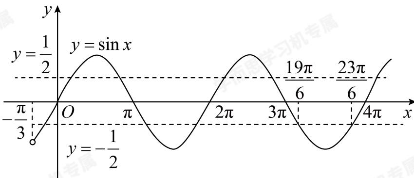

> [!faq]- 2024-2025学年3月内蒙古包头昆都仑区包头市第九中学高一下学期月考数学试卷解析
>
> > [!success]- **【答案】** D
>
> > [!note]- **【解析】**
> > 由题意得 $f(x) = \sin \left( \omega x - \frac{\pi}{6} \right) - \cos \omega x$
> >
> > $$
> > = \frac {\sqrt {3}}{2} \sin \omega x - \frac {1}{2} \cos \omega x - \cos \omega x
> > $$
> >
> > $$
> > = \frac {\sqrt {3}}{2} \sin \omega x - \frac {3}{2} \cos \omega x = \sqrt {3} \sin \left(\omega x - \frac {\pi}{3}\right)
> > $$
> >
> > 由 $|\boldsymbol {f}(x_0)| = \frac{\sqrt{3}}{2}$ ，得 $\sin \left(\omega x_0 - \frac{\pi}{3}\right) = \pm \frac{1}{2},$
> >
> > 因为 $x \in (0, \pi)$ ， $\omega > 0$ ，所以 $\omega x - \frac{\pi}{3} \in \left(-\frac{\pi}{3}, \omega \pi - \frac{\pi}{3}\right)$
> >
> > 由题意得 $\frac{19\pi}{6} < \omega \pi - \frac{\pi}{3} \leqslant \frac{23\pi}{6}$ ，解得 $\frac{7}{2} < \omega \leqslant \frac{25}{6}$ ，
> >
> > 
> >
> > 所以 $\omega$ 的取值范围为 $\left(\frac{7}{2},\frac{25}{6}\right]$
> >
> > 故选：D.
