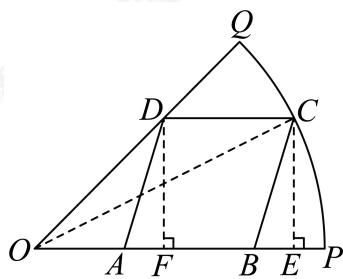

> [!faq]- 2024-2025学年3月内蒙古包头昆都仑区包头市第九中学高一下学期月考数学试卷解析
>
> > [!success]- **【答案】** $400 \left( \sqrt{2} - 1 \right)$
>
> > [!note]- **【分析】**
> > 如图，连接OC，设 $\angle COA = \theta$ ，可用 $\theta$ 的三角函数值表示CE，EF，即可得到四边形ABCD的面积，再根据三角函数的值域的求法即可求解。
>
> > [!note]- **【解析】**
> > 如图所示：
> >
> > 
> >
> > $$
> > \angle C O A = \theta
> > $$
> >
> > $$
> > D F \bot O P, C E \bot O P
> > $$
> >
> > $$
> > \boldsymbol {F}, \boldsymbol {E}
> > $$
> >
> > $$
> > A B = C D = E F, D F = O F, C E = D F
> > $$
> >
> > $$
> > C E = 2 0 \sqrt {2} \sin \theta
> > $$
> >
> > $$
> > E F = O E - O F = 2 0 \sqrt {2} \cos \theta - 2 0 \sqrt {2} \sin \theta .
> > $$
> >
> > $$
> > S = 2 0 \sqrt {2} \sin \theta \times 2 0 \sqrt {2} (\cos \theta - \sin \theta) = 4 0 0 (\sin 2 \theta + \cos 2 \theta - 1)
> > $$
> >
> > $$
> > = 4 0 0 \sqrt {2} \sin \left(2 \theta + \frac {\pi}{4}\right) - 4 0 0
> > $$
> >
> > $$
> > \theta \in \left(0, \frac {\pi}{4}\right)
> > $$
> >
> > 所以当 $\sin \left(2\theta +\frac{\pi}{4}\right) = 1$ 即 $\theta = \frac{\pi}{8}$ 时， $S_{\mathrm{max}} = 400\left(\sqrt{2} -1\right)m^2$
> >
> > 故答案为: $400 \left( \sqrt{2} - 1 \right)$ .
