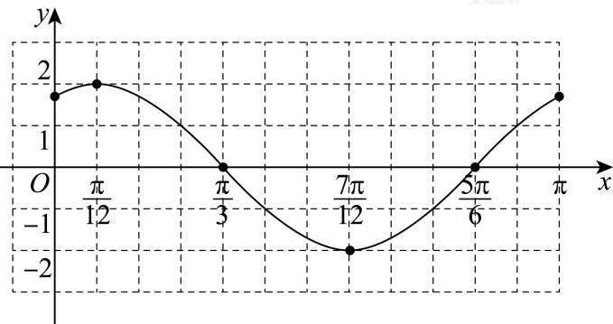

> [!faq]- 2024-2025学年3月内蒙古包头昆都仑区包头市第九中学高一下学期月考数学试卷解析
>
> > [!success]- **【答案】** 详见解析 (2)图象见解析
>
> > [!note]- **【分析】**
> > （1）根据已知得 $f\left(\frac{\pi}{3}\right)=0$ ，解得 $\varphi=\frac{\pi}{3}$ ，结合正弦型函数性质求最值及取最值时x的值；
>
> > [!note]- **【解析】**
> > （1）由题设知 $f\left(\frac{\pi}{3}\right)=2\sin\left(2\times\frac{\pi}{3}+\varphi\right)=0$ ，则
> >
> > $$
> > \frac {2 \pi}{3} + \varphi = k \pi , k \in \mathbf {Z}, \therefore \varphi = - \frac {2 \pi}{3} + k \pi , k \in \mathbf {Z}. \because 0 <   \varphi <   \frac {\pi}{2}, \therefore k = 1
> > $$
> >
> > ， $\varphi = \frac{\pi}{3}$
> >
> > $\therefore f(x) = 2\sin \left(2x + \frac{\pi}{3}\right)$ ，其最大值为2，最小值为-2.
> >
> > 当 $2x + \frac{\pi}{3} = \frac{\pi}{2} + 2k\pi, k \in \mathbb{Z}$ ，即 $x = \frac{\pi}{12} + k\pi, k \in \mathbb{Z}$ 时，函数 $f(x)$ 取得最大值2；
> >
> > 当 $2x+\frac{\pi}{3}=-\frac{\pi}{2}+2k\pi,k\in\mathbb{Z}$ ，即 $x=-\frac{5\pi}{12}+k\pi,k\in\mathbb{Z}$ 时，函数 $f(x)$ 取得最小值-2.
> >
> > (2)
> >
> > <table><tr><td> $2x + \frac{\pi}{3}$ </td><td> $\frac{\pi}{3}$ </td><td> $\frac{\pi}{2}$ </td><td> $\pi$ </td><td> $\frac{3\pi}{2}$ </td><td> $2\pi$ </td><td> $\frac{7\pi}{3}$ </td></tr><tr><td> $x$ </td><td>0</td><td> $\frac{\pi}{12}$ </td><td> $\frac{\pi}{3}$ </td><td> $\frac{7\pi}{12}$ </td><td> $\frac{5\pi}{6}$ </td><td> $\pi$ </td></tr><tr><td> $y$ </td><td> $\sqrt{3}$ </td><td>2</td><td>0</td><td>-2</td><td>0</td><td> $\sqrt{3}$ </td></tr></table>
> >
> > ∴函数 $f(x)$ 在 $[0,\pi]$ 上的简图如下，
> >
> > 
