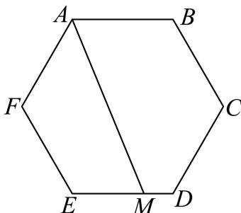

<!-- question-source:start -->
4. 如图，在正六边形 $ABCDEF$ 中，点 $M$ 满足 $\overrightarrow{EM} = 2\overrightarrow{MD}$ ，则 $\overrightarrow{AM} = (\quad)$

A. $\overrightarrow{2AB} +\frac{1}{3}\overrightarrow{BC}$ B. $-\frac{1}{3}\overrightarrow{AB} +2\overrightarrow{BC}$ C. $\frac{1}{3}\overrightarrow{AB} +\overrightarrow{BC}$ D. $\frac{4}{3}\overrightarrow{AB} +\frac{2}{3}\overrightarrow{BC}$
<!-- question-source:end -->

![[Q00091270A1]]
