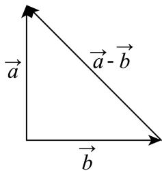
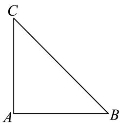

> [!faq]- 2024-2025学年4月内蒙古包头昆都仑区包钢第一中学高一下学期月考数学试卷解析
>
> > [!success]- **【答案】** C
>
> > [!note]- **【分析】**
> > 根据零向量以及单位向量的相关概念，可得AB的正误；由题意作图，根据数形结合思想，可得CD的正误.
>
> > [!note]- **【解析】**
> > 对于A，根据零向量的概念可得零向量的方向是任意的，故A错误；
> >
> > 对于B，所有的单位向量长度相同，方向不一定相同，故B错误；
> >
> > 对于C，由题意可作图如下：
> >
> > 
> >
> > 由图及三角不等式得 $\left|\overrightarrow{a}-\overrightarrow{b}\right|\leq\left|\overrightarrow{a}\right|+\left|\overrightarrow{b}\right|=3$ ，故C正确；
> > 对于D，由题意可作等腰直角三角形ABC， $\angle A=90^{\circ}$ ，如下图：
> >
> > 
> >
> > 当 $\overrightarrow{a} = \overrightarrow{AB}$ ， $\overrightarrow{b} = \overrightarrow{AD}$ 时，显然 $\left|\overrightarrow{a}\right| = \left|\overrightarrow{b}\right|$ ，但 $\overrightarrow{a} \perp \overrightarrow{b}$ ，故D错误.
> >
> > 故选：C.
