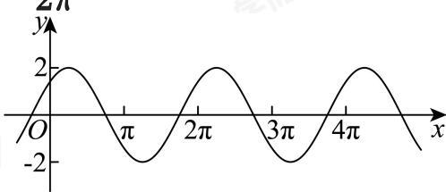

> [!faq]- 2024-2025学年4月内蒙古包头昆都仑区包钢第一中学高一下学期月考数学试卷解析
>
> > [!success]- **【答案】** BD
>
> > [!note]- **【分析】**
> > 利用换元法可得 $f(x)$ 在区间上的单调性，可判断A选项，结合 $f(x)$ 的最大值点可判断B选项，利用平移得到目标函数可判断其对称性，利用数形结合与周期性可得到其实数根的个数.
>
> > [!note]- **【解析】**
> > 对于A，因 $x\in(0,\frac{\pi}{2})$ ，则 $t=x+\frac{\pi}{4}\in(\frac{\pi}{4},\frac{3\pi}{4})$ ，且因为 $y=\sin t$ 在 $t\in(\frac{\pi}{4},\frac{3\pi}{4})$ 上不单调，所以A错误，
> > 对于B， $f(\frac{\pi}{4})=2\sin\frac{\pi}{2}=2$ 为 $f(x)$ 的最大值，所以 $\forall x\in R,f(x)\leq f\left(\frac{\pi}{4}\right)$ ，B正确，
> >
> > 对于C，因为 $f(x + \frac{\pi}{4}) = 2\sin (x + \frac{\pi}{4} + \frac{\pi}{4}) = 2\cos x$ 不为奇函数，所以C错误，
> > 对于D，由 $T=\frac{2\pi}{\varpi}=2\pi$ ，所以由图像可得，其在x=0处 $f(x)=\sqrt{2}$ 有一个根，在 $(0,2\pi]$ 有两个根，在 $(2\pi,4\pi]$ 有两个根，依此类推，则共有 $\frac{2022\pi}{2\pi}=1011$ 个周期，所以共有 $1011\times2+1$ 个根，D正确.
> >
> > 
> >
> > 故选：BD
