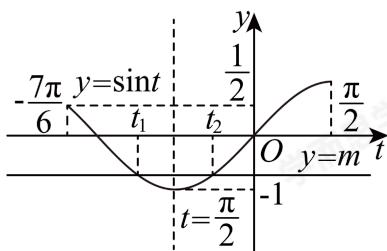

> [!faq]- 2024-2025学年4月内蒙古包头昆都仑区包钢第一中学高一下学期月考数学试卷解析
>
> > [!success]- **【答案】** 详见解析 (2) $\left[\frac{\pi}{3} + k\pi, \frac{5}{6}\pi + k\pi\right](k \in \mathbf{Z})$ (3) $\sqrt{3}$
>
> > [!note]- **【解析】**
> > （1） $f(x) = \overrightarrow{a}\cdot \overrightarrow{b} +\frac{1}{2} = \sqrt{3}\sin \omega x\cos \omega x - \cos^2\omega x + \frac{1}{2}$ $= \frac{\sqrt{3}}{2}\sin 2\omega x - \frac{1}{2}\cos 2\omega x = \sin (2\omega x - \frac{\pi}{6}),$ 因为 $f(x)$ 的图象上相邻两条对称轴之间的距离为 $\frac{\pi}{2}$ 所以该函数的最小正周期 $T = 2\times \frac{\pi}{2} = \pi ,$ 则 $2\omega = \frac{2\pi}{T} = 2,$ 所以 $f(x) = \sin \left(2x - \frac{\pi}{6}\right).$
> >
> > (2) 由 $\frac{\pi}{2} + 2k\pi \leq 2x - \frac{\pi}{6} \leq \frac{3}{2}\pi + 2k\pi (k \in \mathbb{Z})$ 得 $\frac{\pi}{3} + k\pi \leq x \leq \frac{5}{6}\pi + k\pi (k \in \mathbb{Z})$ 所以 $f(x)$ 的单调递减区间是 $\left[\frac{\pi}{3} + k\pi, \frac{5}{6}\pi + k\pi\right] (k \in \mathbb{Z})$ .
> >
> > （3）由 $\left[f(x)\right]^{2}-(m+1)f(x)+m=0$ 得 $f(x)=1$ 或 $f(x)=m$ ,
> > 即 $\sin\left(2x-\frac{\pi}{6}\right)=1$ 或 $\sin\left(2x-\frac{\pi}{6}\right)=m,$ 由 $x\in\left[-\frac{\pi}{2},\frac{\pi}{3}\right]$ ,
> >
> > 可得 $t=2x-\frac{\pi}{6}\in\left[-\frac{7\pi}{6},\frac{\pi}{2}\right]$ ,
> >
> > 由 $\sin t = 1$ 得 $t = 2x - \frac{\pi}{6} = \frac{\pi}{2}$
> >
> > 解得 $x_{3}=\frac{\pi}{3};$
> >
> > 
> >
> > 所以 $\sin t = m$ 在 $t\in \left[-\frac{7\pi}{6},\frac{\pi}{2}\right]$ 上有两个不同的解，
> >
> > 由图知， $m\in \left(-1,\frac{1}{2}\right],$
> >
> > 且 $t_1 + t_2 = 2 \times \left(-\frac{\pi}{2}\right) = -\pi,$
> >
> > 即 $\left(2x_{1} - \frac{\pi}{6}\right) + \left(2x_{2} - \frac{\pi}{6}\right) = -\pi,$
> >
> > 所以 $x_{1}+x_{2}=-\frac{\pi}{3},x_{1}+x_{2}+2x_{3}=\frac{\pi}{3},$
> >
> > 所以 $\tan (x_1 + x_2 + 2x_3) = \tan \frac{\pi}{3} = \sqrt{3}.$
