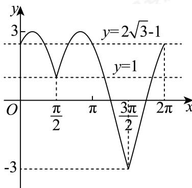

> [!faq]- 2024-2025学年4月内蒙古包头昆都仑区包钢第一中学高一下学期月考数学试卷解析
>
> > [!success]- **【答案】** 详见解析 (2)证明见解析 (3) $(1, 2\sqrt{3} - 1) \cup (2\sqrt{3} - 1, 3)$
>
> > [!note]- **【分析】**
> > （1）利用两角和的正弦公式与诱导公式化简 $f(x)$ ，依题即得 $\overrightarrow{OM}$ ，求其模长即可；
>
> > [!note]- **【解析】**
> > （1）因为
> >
> > $$
> > f (x) = 2 \sin (x + \frac {\pi}{6}) + 4 \sin (x - \frac {\pi}{2}) = \sqrt {3} \sin x + \cos x - 4 \cos x = \sqrt {3} \sin x - 3 \cos x
> > $$
> >
> > 则 $\overrightarrow{OM} = (\sqrt{3}, - 3)$ ，故 $|\overrightarrow{OM}| = \sqrt{(\sqrt{3})^2 + (-3)^2} = 2\sqrt{3}.$
> >
> > (2) 依题意， $f(x) = \sqrt{3} \sin x - \cos x$ ，
> > 由 $f(A) = \sqrt{3} \sin A - \cos A = 2 \sin \left( A - \frac{\pi}{6} \right) = 1$ 可得 $\sin \left( A - \frac{\pi}{6} \right) = \frac{1}{2}$ ，因 $0 < A < \pi$ ，则 $-\frac{\pi}{6} < A - \frac{\pi}{6} < \frac{5\pi}{6}$ ，故 $A - \frac{\pi}{6} = \frac{\pi}{6}$ ，解得 $A = \frac{\pi}{3}$ 。 $\sin (B - C) = \sin B \cos C - \cos B \sin C = \frac{\sqrt{3}}{4}$ ，①
> > 因 $B + C = \pi - A$ ，则 $\sin (B + C) = \sin B \cos C + \cos B \sin C = \sin A = \frac{\sqrt{3}}{2}$ ，②+①可得： $\sin B \cos C = \frac{3\sqrt{3}}{8}$ ，②-①可得 $\cos B \sin C = \frac{\sqrt{3}}{8}$ ，两式相比可得： $\frac{\sin B \cos C}{\cos B \sin C} = 3$ ，即 $\tan B = 3\tan C$ 。
> > （3）依题意， $f(x) = 2 \sin x + \cos x$ ，
> > 由 $f(x) = m + 2 \cos^2 \frac{x}{2} - 2\sqrt{3} |\cos x|$ 可得 $2 \sin x + \cos x = m + \cos x + 1 - 2\sqrt{3} |\cos x|$ ，即 $m = 2 \sin x + 2\sqrt{3} |\cos x| - 1$ ，
> > 当 $0 \leq x \leq \frac{\pi}{2}$ 或 $\frac{3\pi}{2} \leq x \leq 2\pi$ 时， $m = 2 \sin x + 2\sqrt{3} \cos x - 1 = 4 \sin (x + \frac{\pi}{3}) - 1$ ；
> > 当 $\frac{\pi}{2} < x < \frac{3\pi}{2}$ 时， $m = 2 \sin x - 2\sqrt{3} \cos x - 1 = 4 \sin (x - \frac{\pi}{3}) - 1$ ，作出函数 $y = 2 \sin x + 2\sqrt{3} |\cos x| - 1$ 在[0, $2\pi]$ 上的图象。
> >
> > 
> >
> > 因方程 $f(x) = m + 2\cos^{2}\frac{x}{2} - 2\sqrt{3} |\cos x|$ 在 $[0, 2\pi]$ 上有且仅有四个不相等的实数根
> >
> > 等价于函数 $y = m$ 与函数 $y = 2\sin x + 2\sqrt{3} |\cos x| - 1$ 的图象在 $[0, 2\pi]$ 上有四个交点.
> >
> > 由图知，当且仅当 $1 < m < 2\sqrt{3} - 1$ 或 $2\sqrt{3} - 1 < m < 3$ 时，两者有四个交点.
> >
> > 故实数 $m$ 的取值范围为 $(1, 2\sqrt{3} - 1) \cup (2\sqrt{3} - 1, 3)$ .
