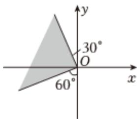

<!-- question-source:start -->
8、函数 $f(x)=\cos2x-6\cos x+1$ 的值域为（）
A $\left[-\frac{9}{2}, +\infty\right)$

B $[- \frac{9}{2}, -4]$ C $[-4, 8]$ D $[- \frac{9}{2}, 8]$
<!-- question-source:end -->

![[Q00090618A1]]
