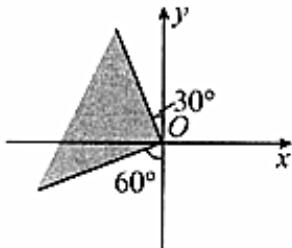

> [!faq]- 2024-2025学年内蒙古乌兰察布市集宁二中高一（下）月考数学试卷（4月份）解析
>
> > [!success]- **【答案】** D
>
> > [!note]- **【解析】**
> > 角 $\alpha$ 的终边落在如图所示的阴影部分内，
> >
> > 
> >
> > 则角 $\alpha$ 在一个周期内的范围是 $\left[\frac{2\pi}{3}, \frac{7\pi}{6}\right]$
> >
> > 则角 $\alpha$ 的取值范围是 $[2k\pi + \frac{2\pi}{3}, 2k\pi + \frac{7\pi}{6}]$ ( $k \in Z$ ),
> >
> > 故选：D.
