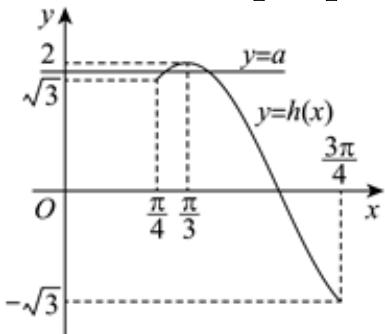

> [!faq]- 2024-2025学年内蒙古乌兰察布市集宁二中高一（下）月考数学试卷（4月份）解析
>
> > [!success]- **【答案】** 详见解析
>
> > [!note]- **【解析】**
> > 详见解析
> >
> > （1）将函数 $f(x)$ 的图象上的点的横坐标缩短到原来的 $\frac{1}{4}$ （纵坐标不变），得函数 $y = cos(2x + \frac{\pi}{3})$ 的图象，
> > 再将得到的图象向右平移 $\frac{\pi}{3}$ 个单位长度，得函数 $y = cos[2(x - \frac{\pi}{3}) + \frac{\pi}{3}] = cos(2x - \frac{\pi}{3})$ 的图象，
> > 最后将得到的图象上点的纵坐标伸长到原来的2倍（横坐标不变），得到函数 $y = g(x)$ 的图象，
> > 所以函数 $g(x)$ 的解析式是 $g(x)=2cos(2x-\frac{\pi}{3})$ .
> > (2)由（1）知， $h(x)=g(x-\frac{\pi}{6})=2cos(2x-\frac{2\pi}{3})$ ，当 $x\in[\frac{\pi}{4},\frac{3\pi}{4}]$ 时， $2x-\frac{2\pi}{3}\in[-\frac{\pi}{6},\frac{5\pi}{6}]$ 由 $-\frac{\pi}{6}\leq2x-\frac{2\pi}{3}\leq0$ ，得 $\frac{\pi}{4}\leq x\leq\frac{\pi}{3}$ ，由 $0\leq2x-\frac{2\pi}{3}\leq\frac{5\pi}{6}$ ，得 $\frac{\pi}{3}\leq x\leq\frac{3\pi}{4}$ ，
> > 因此函数 $h(x)$ 在 $[\frac{\pi}{4},\frac{\pi}{3}]$ 上递增，函数值从 $\sqrt{3}$ 增大到2，在 $[\frac{\pi}{3},\frac{3\pi}{4}]$ 上递减，函数值从2减小到 $-\sqrt{3}$ ，
> > 函数 $y=h(x)$ 在 $[\frac{\pi}{4},\frac{3\pi}{4}]$ 上的图象，如图，
> >
> > 
> >
> > 当 $\sqrt{3} \leq a < 2$ 时，直线 $y = a$ 与函数 $y = h(x)$ 在 $[\frac{\pi}{4}, \frac{3\pi}{4}]$ 上的图象有两个公共点，所以方程 $h(x) = a$ 在区间 $[\frac{\pi}{4}, \frac{3\pi}{4}]$ 上恰有两个实数根，实数 $a$ 的取值范围是 $\{a | \sqrt{3} \leq a < 2\}$ .
