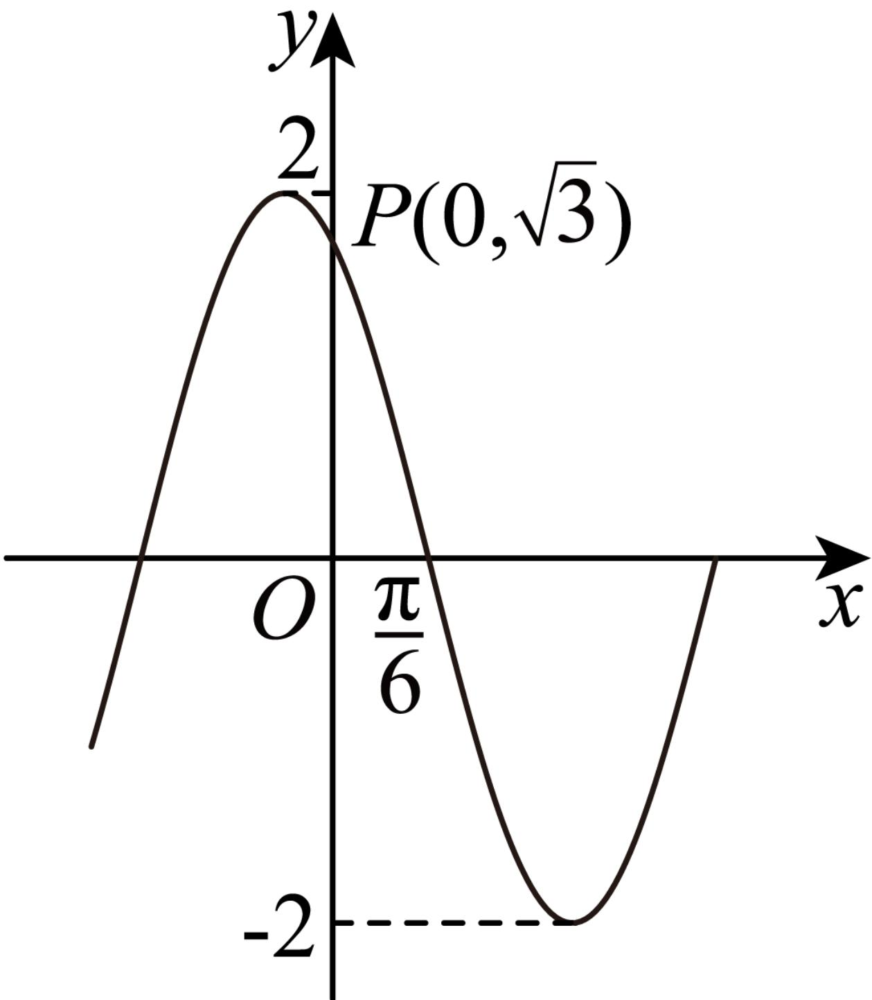

<!-- question-source:start -->
3、函数 $f(x)$ 的部分图象（点P在图象上）如图所示，则 $f(x)$ 的解析式为\_\_\_\_. $= A \sin (\omega x + \varphi)(A < 0, 0, \omega < 3, -\frac{\pi}{2} < \varphi < 0)$

<!-- question-source:end -->

![[Q00090643A1]]
