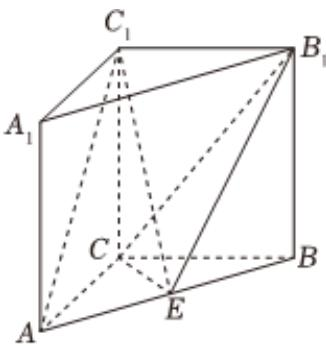

<!-- question-source:start -->
3、如图，在直三棱柱 $ABC-A_{1}B_{1}C_{1}$ 中，AC=CB=CC1=2， $\angle ACB=120^{\circ}$ ，E为AB的中点.

1 求证： $AC_{1}$ // 平面 $B_{1}CE$ ;

2 求三棱锥 $B-B_{1}CE$ 的体积.
<!-- question-source:end -->

![[Q00090646A1]]
