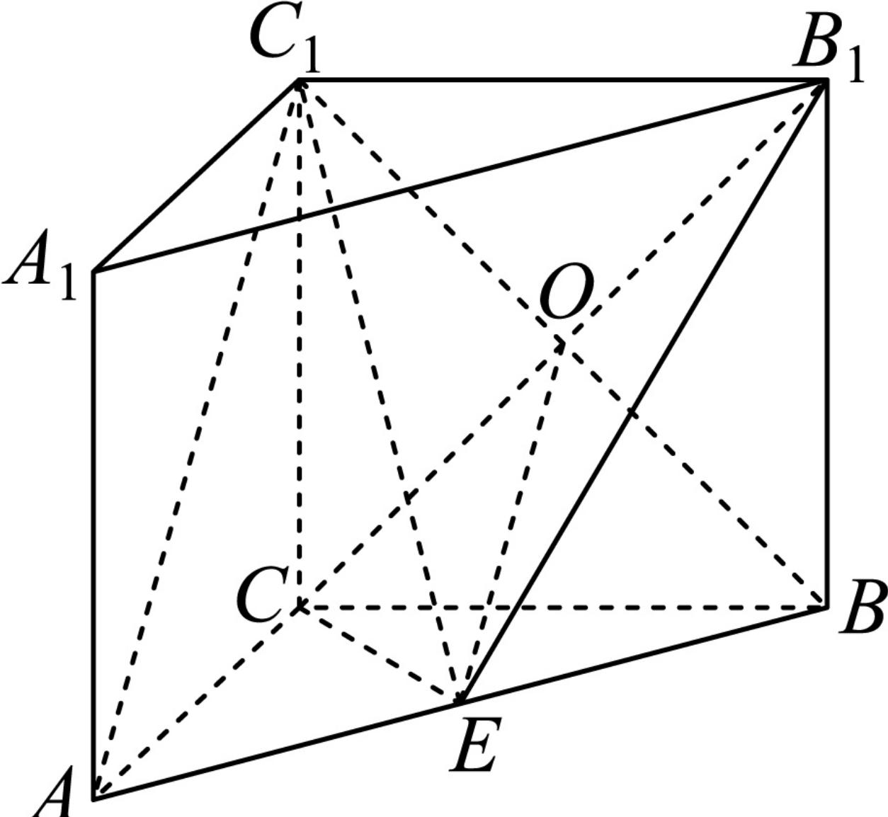

> [!faq]- 2024-2025学年内蒙古乌兰察布市集宁二中高一（下）期中数学试卷解析
>
> > [!success]- **【答案】** 详见解析
>
> > [!note]- **【解析】**
> > 详见解析
> >
> > (1) 证明：连接 $BC_{1}$ ，设 $C_{1}B\cap CB_{1}=O$ ，连接OE，
> >
> > 
> >
> > 在直三棱柱 $ABC-A_{1}B_{1}C_{1}$ 中，四边形 $BB_{1}C_{1}C$ 为平行四边形，则O为 $BC_{1}$ 的中点，又因为E为AB的中点，则 $OE\parallel AC_{1}$ ，
> >
> > 因为 $AC_{1}\neq$ 平面 $B_{1}CE,OE\subset$ 平面 $B_{1}CE$
> >
> > 所以 $AC_{1}$ // 平面 $B_{1}CE$ .
> >
> > (2)因为 $V_{B-B_{1}CE}=V_{B_{1}-BCE}=\frac{1}{3}S_{\triangle BCE}\bullet BB_{1}$
> >
> > 在 $\triangle ABC$ 中， $AC=BC=2$ ， $E$ 为 $AB$ 的中点， $\angle ACB=120^{\circ}$ ，所以
> >
> > $$
> > \begin{array}{l} {V _ {B _ {1} - B C E} = \frac {1}{3} S _ {\triangle B C E} \bullet B B _ {1} = \frac {1}{3} \times \frac {1}{2} S _ {\triangle A C B} \bullet B B _ {1} = \frac {1}{3} \times \frac {1}{2} \times \frac {1}{2} \times 2 \times 2 \times \frac {\sqrt {3}}{2} \times 2} \\ {= \frac {\sqrt {3}}{3}} \end{array}
> > $$
