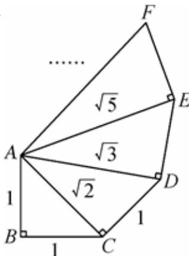

<!-- question-source:start -->
8、古希腊数学家泰特托斯(Theaetetus，公元前417—公元前369年）详细地讨论了无理数的理论，他通过如图来构造无理数 $\sqrt{2}$ ， $\sqrt{3}$ ， $\sqrt{5}$ ，…，则 $\sin \angle CAE = (\quad)$ A $\frac{2\sqrt{6} + 3\sqrt{3}}{15}$ B $\frac{2\sqrt{15} + 3\sqrt{5}}{15}$ C $\frac{2\sqrt{3} + \sqrt{6}}{6}$

D $\frac{2\sqrt{3}-\sqrt{6}}{6}$
<!-- question-source:end -->

![[Q00091729A1]]
