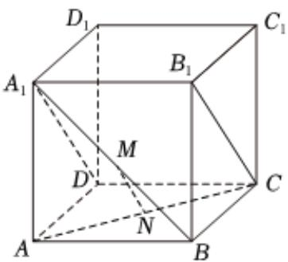
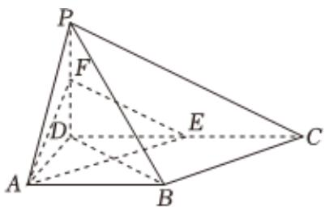

<!-- question-source:start -->
4. 如图，在正方体 $ABCD - A_{1}B_{1}C_{1}D_{1}$ 中， $M$ 、 $N$ 分别为 $A_{1}B$ 、 $AC$ 的中点.

1 证明： $MN \parallel$ 平面 $BCC_{1}B_{1}$ ;

2 求 $A_{1}B$ 与平面 $A_{1}B_{1}CD$ 所成角的大小.

如图，在四棱锥 $P - ABCD$ 中， $PD \perp$ 平面 $ABCD, AB // DC$ ， $AD \perp DC$ ， $DA = AB = PD = 2$ ， $DC = 4$ ， $E$ ， $F$ 分别为棱 $CD$ ， $PD$ 的中点.

1 求证： $AE \perp$ 平面PBD；

2 求点D到平面PBC的距离.
<!-- question-source:end -->

![[Q00091739A1]]
