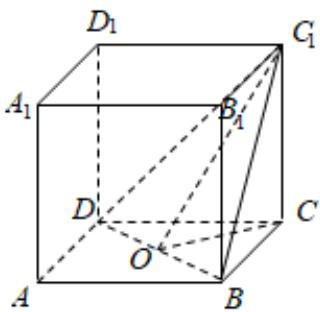

> [!faq]- 2024-2025学年内蒙古乌兰察布市集宁二中高一（下）期末数学试卷解析
>
> > [!success]- **【答案】** $\sqrt{2}$
>
> > [!note]- **【解析】**
> > 设正方体 $ABCD - A_{1}B_{1}C_{1}D_{1}$ 的棱长为 $\pmb{a}$
> >
> > $$
> > B D = D C _ {1} = B C _ {1} = \sqrt {2} a, C D = B C = C C _ {1} = a
> > $$
> >
> > 取BD的中点O，连接 $OC_{1}$ ，OC，则 $\angle COC_{1}$ 就是二面角 $C_{1}-BD-C$ 的平面角，
> >
> > $$
> > \because C O = \frac {1}{2} B D = \frac {\sqrt {2}}{2} a
> > $$
> >
> > $$
> > \therefore \tan \angle C O C _ {1} = \frac {a}{\frac {\sqrt {2}}{2} a} = \sqrt {2}.
> > $$
> >
> > 
> >
> > 故答案为： $\sqrt{2}$ .
