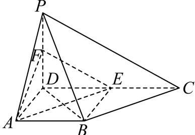

> [!faq]- 2024-2025学年内蒙古乌兰察布市集宁二中高一（下）期末数学试卷解析
>
> > [!success]- **【答案】** 详见解析
>
> > [!note]- **【解析】**
> > 详见解析
> >
> > (1) 证明：如图，连接BE，
> >
> > 
> >
> > 因点 $E$ 为 $DC$ 的中点，且 $AB \parallel DC$ ， $AD \perp DC$ ， $DA = AB = 2$ ， $DC = 4$
> >
> > 所以 $DE = AB$ ，易知四边形ABED是正方形，所以 $AE \perp BD$
> >
> > 因为 $PD \perp$ 平面ABCD，AE⊂平面ABCD，所以AE⊥PD，
> >
> > 又因为 $BD \cap PD = D$ ， $BD$ ， $PD \subset$ 平面 $PBD$
> >
> > 所以 $AE \perp$ 平面PBD.
> >
> > (2)在 $Rt\triangle PCD$ 中， $PC = \sqrt{PD^2 + DC^2} = \sqrt{2^2 + 4^2} = 2\sqrt{5}$
> >
> > 在 $Rt\triangle PDB$ 中， $PB = \sqrt{PD^2 + DB^2} = \sqrt{2^2 + (2\sqrt{2})^2} = 2\sqrt{3}$
> >
> > 又 $BC = \sqrt{BE^2 + EC^2} = \sqrt{2^2 + 2^2} = 2\sqrt{2}$
> >
> > 因为 $BC^{2}+PB^{2}=PC^{2}$ ，所以 $PB\perp BC$ ，
> >
> > 则 $\triangle BDC$ 的面积为 $S_{\triangle BDC} = \frac{1}{2}\times 4\times 2 = 4$ ， $\triangle PBC$ 的面积为
> >
> > $$
> > S _ {\triangle P B C} = \frac {1}{2} \times 2 \sqrt {3} \times 2 \sqrt {2} = 2 \sqrt {6},
> > $$
> >
> > 设点D到平面PBC的距离为d，
> >
> > 因为 $V_{P-BDC}=V_{D-PBC}$ ，
> >
> > 所以 $\frac{1}{3} \times S_{\triangle BDC} \times PD = \frac{1}{3} \times S_{\triangle PBC} \times d$
> >
> > 则 $d=\frac{4\times2}{2\sqrt{6}}=\frac{2}{3}\sqrt{6}$ ，
> >
> > 即点 $D$ 到平面 $PBC$ 的距离为 $\frac{2}{3}\sqrt{6}$ .
