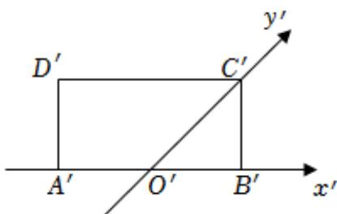

<!-- question-source:start -->
2、如图，水平放置的四边形ABCD的斜二测直观图为矩形 $A^{\prime}B^{\prime}C^{\prime}D^{\prime}$ ，已知 $A^{\prime}O^{\prime}=O^{\prime}B^{\prime}=2$ ， $B^{\prime}C^{\prime}=2$ ，则四边形ABCD的周长为（）
A 20
B 12
C $8 + 4\sqrt{3}$ D $8 + 4\sqrt{2}$

<!-- question-source:end -->

![[Q00091742A1]]
