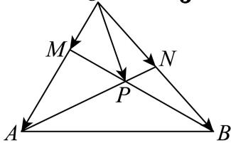

<!-- question-source:start -->
3、如图所示，在 $\triangle OAB$ 中， $\overrightarrow{OA} = \overrightarrow{a}$ ， $\overrightarrow{OB} = \overrightarrow{b}$ ， $M$ ， $N$ 分别是 $OA$ ， $OB$ 上的点，且 $\overrightarrow{OM} = \frac{1}{3}\overrightarrow{a}$

， $\overrightarrow{ON} = \frac{1}{2}\overrightarrow{b}$ .设 $AN$ 与 $BM$ 交于点 $P$ ，用向量 $\overrightarrow{a}$ ， $\overrightarrow{b}$ 表示 $\overrightarrow{OP} =$

<!-- question-source:end -->

![[Q00091754A1]]
