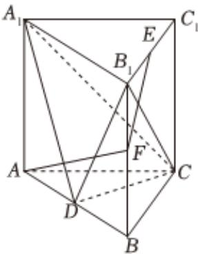

<!-- question-source:start -->
2、如图，在高为2的正三棱柱 $ABC-A_{1}B_{1}C_{1}$ 中，AB=2，D是棱AB的中点.

1 求三棱锥 $D - A_{1}B_{1}C_{1}$ 的体积；

2 设 $E$ 为棱 $B_{1}C_{1}$ 的中点， $F$ 为棱 $BB_{1}$ 上一点，求 $AF + EF$ 的最小值.
<!-- question-source:end -->

![[Q00091756A1]]
