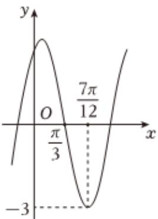

<!-- question-source:start -->
3、

已知函数 $f(x)=A\cos(\omega x+\varphi)(A>0,\omega>0,-\frac{\pi}{2}<\varphi<0)$ 的部分图像如图所示.

1 求 $f(x)$ 的解析式及对称中心；

2 若 $f(x) = -\frac{3}{2}$ , $x \in [-\frac{\pi}{2}, \frac{\pi}{2}]$ 求 $x$ 的值；

3 若方程 $2f(x) - 3\sqrt{3} = 0$ 在 $(0, m)$ 上恰有5个不相等的实数根，求 $m$ 的取值范围.
<!-- question-source:end -->

![[Q00091757A1]]
