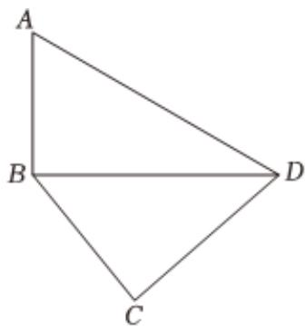

<!-- question-source:start -->
5、

定义平面凸四边形为没有内角度数大于 $180^{\circ}$ 的四边形.如图，已知平面凸四边形ABCD中， $AB = 3$ ， $BC = 2\sqrt{3}$ ， $AD = 6$

若四边形ABCD被对角线BD分为面积相等的两部分，且 $\angle A=60^{\circ}$ ；

①求CD的长；
1 ②若 $\overrightarrow{AM}=\frac{2}{3}\overrightarrow{AC}$ ，求 $\overrightarrow{BM}\cdot\overrightarrow{DM}$ 的值.

2 若 $CD = 3\sqrt{3}$ ，求四边形ABCD面积的最大值.
<!-- question-source:end -->

![[Q00091759A1]]
