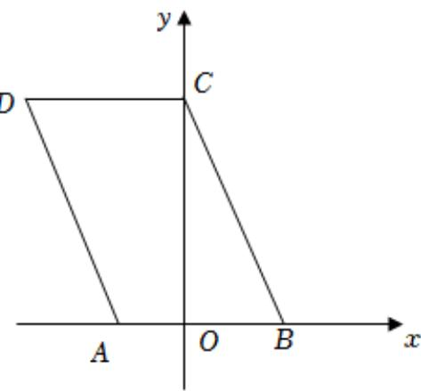

> [!faq]- 2024-2025学年内蒙古乌海一中高一（下）期中数学试卷解析
>
> > [!success]- **【答案】** A
>
> > [!note]- **【解析】**
> > 根据题意，矩形 $A'B'C'D'$ ， $A'O' = O'B' = 2$ ， $B'C' = 2$
> >
> > 则 $O^{\prime}C^{\prime}=2\sqrt{2}$ ，
> >
> > 如图：原图矩形ABCD中，
> >
> > $$
> > A B = A O + O B = A ^ {\prime} O ^ {\prime} + O ^ {\prime} B ^ {\prime} = 4, O C = 2 O ^ {\prime} C ^ {\prime} = 4 \sqrt {2}
> > $$
> >
> > $BC = \sqrt{OB^2 + OC^2} = \sqrt{4 + 32} = 6$
> >
> > 则四边形ABCD的周长 $l=2(AB+BC)=20$ ;
> >
> > 故选：A.
> >
> > 
