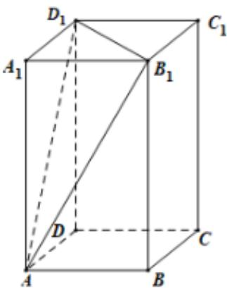

> [!faq]- 2024-2025学年内蒙古乌海一中高一（下）期中数学试卷解析
>
> > [!success]- **【答案】** D
>
> > [!note]- **【解析】**
> > 将平行六面体截去三棱锥后，剩余部分几何体的体积等于平行六面体的体积减去三棱锥的体积，
> >
> > 记平行六面体 $ABCD - A_{1}B_{1}C_{1}D_{1}$ 的体积为 $V = 1$
> >
> > 则三棱锥 $A - A_{1}B_{1}D_{1}$ 的体积
> >
> > $$
> > V _ {1} = \frac {1}{3} \cdot S _ {\triangle A _ {1} B _ {1} D _ {1}} \cdot h = \frac {1}{3} \cdot \frac {1}{2} \cdot S _ {\text {四边形} A _ {1} B _ {1} C _ {1} D _ {1}} \cdot h = \frac {1}{6} V = \frac {1}{6},
> > $$
> >
> > 所以剩余部分几何体的体积为 $V - V_{1} = 1 - \frac{1}{6} = \frac{5}{6}$ .
> >
> > 故选：D.
> >
> > 
