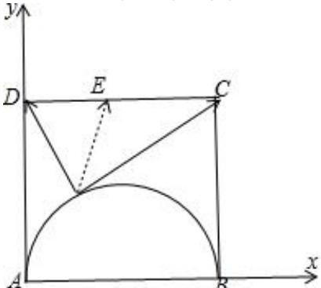
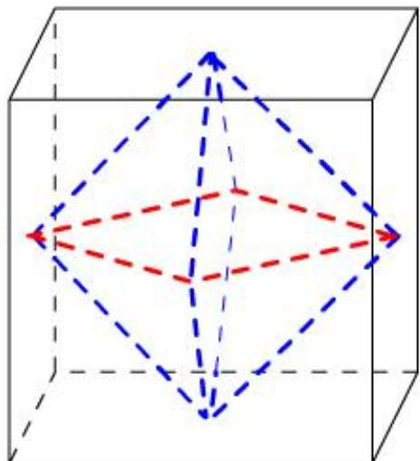

> [!faq]- 2024-2025学年内蒙古乌海一中高一（下）期中数学试卷解析
>
> > [!success]- **【答案】** B
>
> > [!note]- **【解析】**
> > 建立直角坐标系，如图所示：正方形ABCD的边长为4，
> >
> > 
> >
> > 设： $A(0,0),B(4,0),C(4,4),D(0,4)$
> >
> > 取 $CD$ 的中点 $\pmb{E}$ ，连接 $PE$ ，所以 $PE$ 的取值范围为 $[\frac{AD}{2}, AE]$
> >
> > 
> >
> > $$
> > \mathbb {I} [ 2, 2 \sqrt {5} ]
> > $$
> >
> > $$
> > \overrightarrow {P C} \cdot \overrightarrow {P D} = (\overrightarrow {P E} + \overrightarrow {E D}) \cdot (\overrightarrow {P E} + \overrightarrow {E C}) = \overrightarrow {P E} ^ {2} - \frac {\overrightarrow {C D} ^ {2}}{4}
> > $$
> >
> > 故 $\overrightarrow{PC} \cdot \overrightarrow{PD} \in [0, 16]$ .
> >
> > 故选：B.
