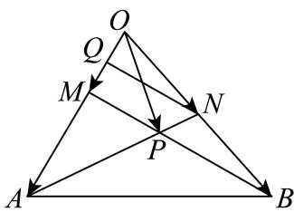

> [!faq]- 2024-2025学年内蒙古乌海一中高一（下）期中数学试卷解析
>
> > [!success]- **【答案】** $\frac{1}{5}\overrightarrow{a} +\frac{2}{5}\overrightarrow{b}$
>
> > [!note]- **【解析】**
> > 如图所示，取 $OM$ 的中点 $Q$ ，连接 $QN$
> >
> > 因为M是OA的三等分点，所以OQ= $\frac{1}{6}$ OA，
> >
> > 又N是OB的中点，所以QN//MB，
> >
> > 所以 $\triangle APM\sim \triangle ANQ$
> >
> > 
> >
> > 所以 $\frac{AP}{AN} = \frac{AM}{AQ} = \frac{\frac{2}{3}OA}{OA - OQ} = \frac{\frac{2}{3}OA}{OA - \frac{1}{6}OA} = \frac{4}{5}$
> >
> > 所以 $\overrightarrow{AP} = \frac{4}{5}\overrightarrow{AN}$
> >
> > $$
> > \overrightarrow {O P} = \overrightarrow {O A} + \overrightarrow {A P} = \overrightarrow {O A} + \frac {4}{5} \overrightarrow {A N} = \overrightarrow {O A} + \frac {4}{5} \times (\overrightarrow {O N} - \overrightarrow {O A}) = \frac {1}{5} \overrightarrow {O A} + \frac {2}{5} \overrightarrow {O B} = \frac {1}{5} \overrightarrow {a}
> > $$
> >
> > $$
> > + \frac {2}{5} \overrightarrow {b}
> > $$
> >
> > 故答案为： $\frac{1}{5}\overrightarrow{a} +\frac{2}{5}\overrightarrow{b}.$
