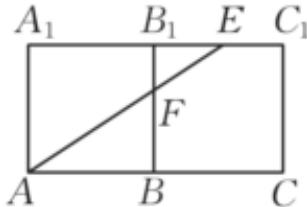

> [!faq]- 2024-2025学年内蒙古乌海一中高一（下）期中数学试卷解析
>
> > [!success]- **【答案】** 详见解析
>
> > [!note]- **【解析】**
> > 详见解析
> >
> > (1) 因为在高为2的正三棱柱 $ABC-A_{1}B_{1}C_{1}$ 中，AB=2，D是棱AB的中点.
> >
> > 所以 $S_{\triangle A_{1}B_{1}C_{1}}=\frac{\sqrt{3}}{4}\times2^{2}=\sqrt{3}$
> >
> > $$
> > V _ {D - A _ {1} B _ {1} C _ {1}} = \frac {1}{3} \times S _ {\triangle A _ {1} B _ {1} C _ {1}} \times A A _ {1} = \frac {1}{3} \times \sqrt {3} \times 2 = \frac {2 \sqrt {3}}{3}
> > $$
> >
> > (2)将侧面 $BBC_{1}B_{1}$ 绕 $BB_{1}$ 旋转至与侧面 $ABB_{1}A_{1}$ 共面，
> >
> > $E$ 为棱 $B_{1}C_{1}$ 的中点， $F$ 为棱 $BB_{1}$ 上一点，如图所示：
> >
> > 
> >
> > 当 $A, F, E$ 三点共线时， $AF + EF$ 取得最小值，
> >
> > 且最小值为 $\sqrt{2^2 + (2 + 1)^2} = \sqrt{13}$ .
