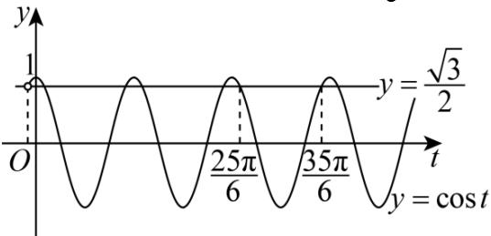

> [!faq]- 2024-2025学年内蒙古乌海一中高一（下）期中数学试卷解析
>
> > [!success]- **【答案】** 详见解析
>
> > [!note]- **【解析】**
> > 详见解析
> >
> > (1)由题意可得 $A = 3$ ，周期 $T = 4\left(\frac{7\pi}{12} - \frac{\pi}{3}\right) = \pi$
> >
> > 则 $\omega = 2$ ， $f(x) = 3\cos (2x + \varphi)$
> >
> > 将点 $(\frac{7\pi}{12}, -3)$ 代入可得 $2\times \frac{7\pi}{12} +\varphi = 2k\pi +\pi ,k\in Z$
> >
> > 解得 $\varphi = -\frac{\pi}{6} + 2k\pi (k \in Z)$ , $\because -\frac{\pi}{2} < \varphi < 0$ , $\therefore \varphi = -\frac{\pi}{6}$ , $f(x) = 3cos(2x - \frac{\pi}{6})$ ;
> >
> > 令 $2x - \frac{\pi}{3} = k\pi +\frac{\pi}{2},k\in Z$ ，解得 $x = \frac{\pi}{3} +\frac{k\pi}{2},(k\in Z)$
> >
> > $f(x)$ 的对称中心为 $\left(\frac{\pi}{3}+\frac{k\pi}{2},0\right),(k\in Z)$ ;
> >
> > (2)由(1)知 $f(x)=3cos(2x-\frac{\pi}{6})$ ,
> >
> > $\therefore 3cos(2x - \frac{\pi}{6}) = -\frac{3}{2}$ 即 $cos(2x - \frac{\pi}{6}) = -\frac{1}{2}$
> >
> > $\therefore 2x - \frac{\pi}{6} = \frac{2\pi}{3} + 2k\pi$ 或 $2x - \frac{\pi}{6} = \frac{4\pi}{3} + 2k\pi, k \in Z$
> >
> > 又 $x\in\left[-\frac{\pi}{2},\frac{\pi}{2}\right]$ ,
> >
> > $$
> > \therefore x = \frac {5 \pi}{1 2} \text {或} x = - \frac {\pi}{4}.
> > $$
> >
> > (3)由(1)知 $f(x)=3cos(2x-\frac{\pi}{6})$ ，则 $g(x)=2f(x)-3\sqrt{3}=6cos(2x-\frac{\pi}{6})-3\sqrt{3}$
> >
> > 
> >
> > 由函数 $g(x)=2f(x)-3\sqrt{3}$ 在 $(0,m)$ 上恰有5个零点，
> >
> > 即 $6cos(2x - \frac{\pi}{6}) - 3\sqrt{3} = 0$ 在 $(0,m)$ 上恰有5个解，
> >
> > 即 $cos(2x - \frac{\pi}{6}) = \frac{\sqrt{3}}{2}$ 在 $(0, m)$ 上恰有5个解，
> >
> > $$
> > \because x \in (0, m), \therefore t = 2 x - \frac {\pi}{6} \in \left(- \frac {\pi}{6}, 2 m - \frac {\pi}{6}\right)
> > $$
> >
> > 即函数 $y = \cos t$ 与 $y = \frac{\sqrt{3}}{2}$ 在区间 $t \in \left(-\frac{\pi}{6}, 2m - \frac{\pi}{6}\right)$ 有5个交点，
> >
> > 则 $\frac{25\pi}{6} < 2m - \frac{\pi}{6} \leqslant \frac{35\pi}{6}$ ，解得 $\frac{13\pi}{6} < m \leqslant 3\pi$
> >
> > 故m的范围为 $\left(\frac{13\pi}{6},3\pi\right]$ .
