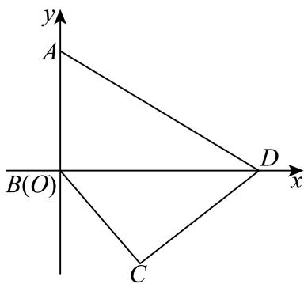

> [!faq]- 2024-2025学年内蒙古乌海一中高一（下）期中数学试卷解析
>
> > [!success]- **【答案】** 详见解析
>
> > [!note]- **【解析】**
> > 详见解析
> >
> > 已知平面凸四边形ABCD中， $AB = 3$ ， $BC = 2\sqrt{3}$ ， $AD = 6$
> >
> > (1)已知四边形ABCD被对角线BD分为面积相等的两部分，且 $\angle A = 60^{\circ}$
> >
> > ①如图，在 $\triangle ABC$ 中， $\angle A=60^{\circ}$ ， $AB=3$ ， $AD=6$
> >
> > 由余弦定理可得 $BD^2 = 3^2 + 6^2 - 2 \times 3 \times 6 \times \cos 60^\circ = 27$ ，则 $BD = 3\sqrt{3}$ ，
> >
> > 注意到 $BD^{2} + AB^{2} = AD^{2}$ ，所以 $\angle ABD = 90^{\circ}$
> >
> > 
> >
> > 又 $S_{\triangle BCD}=S_{\triangle BCD}$ ，得 $\frac{1}{2}AB\cdot ADsin60^{\circ}=\frac{1}{2}BD\cdot BCsin\angle DBC$
> >
> > 即 $9\sin 60^{\circ} = 9\sin \angle DBC\Rightarrow \sin \angle DBC = \frac{\sqrt{3}}{2}$
> >
> > 又因为四边形ABCD为凸四边形， $0 < \angle DBC < 90^{\circ}$ ，故 $\angle DBC = 60^{\circ}$
> >
> > 则在 $\triangle BCD$ 中，由余弦定理可得
> >
> > $$
> > C D ^ {2} = B D ^ {2} + B C ^ {2} - 2 B D \cdot B C \cos 6 0 ^ {\circ} \Rightarrow C D ^ {2} = 1 2 + 2 7 - 1 8 = 2 1
> > $$
> >
> > 所以 $CD=\sqrt{21}$ .
> >
> > ②由①，如图，以B为原点，建立平面直角坐标系，
> >
> > 所以 $B(0,0), D(3\sqrt{3}, 0), A(0,3), C(\sqrt{3}, -3)$ ，则 $\overrightarrow{BD} = (3\sqrt{3}, 0)$ .
> >
> > 设 $M(x,y)$ ，由 $\overrightarrow{AM} = \frac{2}{3}\overrightarrow{AC}$
> >
> > $$
> > \overrightarrow {B M} - \overrightarrow {B A} = \frac {2}{3} \overrightarrow {B C} - \frac {2}{3} \overrightarrow {B A} \Rightarrow \overrightarrow {B M} = \frac {2}{3} \overrightarrow {B C} + \frac {1}{3} \overrightarrow {B A} = (\frac {2 \sqrt {3}}{3}, - 1)
> > $$
> >
> > $$
> > \overrightarrow {B M} ^ {2} = \frac {4}{3} + 1 = \frac {7}{3}, \overrightarrow {B M} \cdot \overrightarrow {B D} = 6
> > $$
> >
> > $$
> > \overrightarrow {B M} \cdot \overrightarrow {D M} = \overrightarrow {B M} \cdot (\overrightarrow {B M} - \overrightarrow {B D}) = \overrightarrow {B M ^ {2}} - \overrightarrow {B M} \cdot \overrightarrow {B D} = - \frac {1 1}{3}.
> > $$
> >
> > (2)若 $CD=3\sqrt{3}$ ,
> >
> > 在 $\triangle ABD$ 和 $\triangle BCD$ 中，
> >
> > 由余弦定理得 $BD^{2} = AB^{2} + AD^{2} - 2AB\cdot AD\cos A = CB^{2} + CD^{2} - 2CB\cdot CD\cos C$ 则 $BD^2 = 45 - 36\cos A = 39 - 36\cos C\Rightarrow \cos A - \cos C = \frac{1}{6}$
> >
> > 四边形ABCD面积为：
> >
> > $$
> > S = S _ {\triangle A B D} + S _ {\triangle C B D} = \frac {1}{2} (A B \cdot A D \sin A + C B \cdot C D \sin C) = 9 \sin A + 9 \sin C,
> > $$
> >
> > 即 $\frac{S}{9} = \sin A + \sin C$ ，所以 $\frac{S^2}{81} +\frac{1}{36} = (\sin A + \sin C)^2 +(\cos A - \cos C)^2$
> >
> > $$
> > = 2 - 2 (\cos A \cos C - \sin A \sin C) = 2 - 2 \cos (A + C) \leqslant 4,
> > $$
> >
> > 当且仅当 $A + C = \pi$ ，即cosA= $\frac{1}{12}$ ，cosC=- $\frac{1}{12}$ 时，cos(A+C)取最小值，
> >
> > $$
> > \frac {S ^ {2}}{8 1} + \frac {1}{3 6} \leqslant 4 \Rightarrow S ^ {2} \leqslant \frac {1 2 8 7}{4} \Rightarrow S _ {m a x} = \frac {3 \sqrt {1 4 3}}{2}
> > $$
> >
> > 所以四边形ABCD面积S的最大值为 $\frac{3\sqrt{143}}{2}$ .
