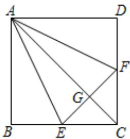
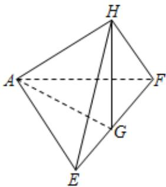

<!-- question-source:start -->
2、如图，在正方形ABCD中，E，F分别是BC，CD的中点，G是EF的中点.现在沿AE，AF及EF把这个正方形折成一个空间图形，使B，C，D三点重合，重合后的点记为H，下列说法正确的是（）

A AG⊥平面EFH
B AH⊥平面EFH
C HF⊥平面AEH
D HG⊥平面AEF
<!-- question-source:end -->

![[Q00090658A1]]
