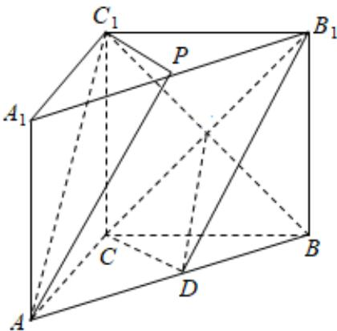

<!-- question-source:start -->
2、

如图，在三棱柱 $ABC-A_{1}B_{1}C_{1}$ 中，D、P分别是棱AB， $A_{1}B_{1}$ 的中点，求证：

1 $AC_{1} //$ 平面 $B_{1}CD$

2 平面 $APC_{1}$ // 平面 $B_{1}CD$ .
<!-- question-source:end -->

![[Q00090664A1]]
