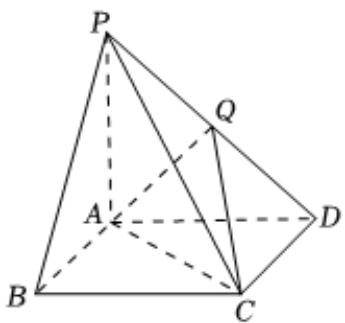

<!-- question-source:start -->
4、

如图，在四棱锥 $P - ABCD$ 中，底面ABCD是边长为2的正方形，PA⊥平面ABCD，Q为棱PD的中点.

1 求证： $PB//$ 平面 $ACQ$ ；

已知： $AQ \perp PD$

①求直线PC与平面ACQ所成角的正弦值；

2 ②求点P到平面ACQ的距离.
<!-- question-source:end -->

![[Q00090666A1]]
