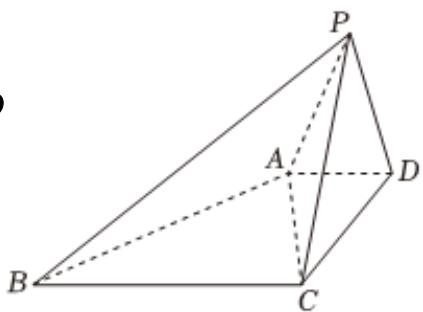

<!-- question-source:start -->
5、

如图，在四棱锥P-ABCD中，

$AD = 1, BC = 3, CD = 2, AC = \sqrt{5}, BC \perp PC, PC = PD$ ，侧面 $PCD \perp$ 平面 $ABCD$ .

1 证明： $BC \perp$ 平面PCD；

2 证明： $BC//$ 平面 $PAD$ ；

3 若直线 $BP$ 与平面 $ABCD$ 所成角的正切值为 $\frac{\sqrt{10}}{5}$ ，求三棱锥 $P - ABC$ 的体积.
<!-- question-source:end -->

![[Q00090667A1]]
