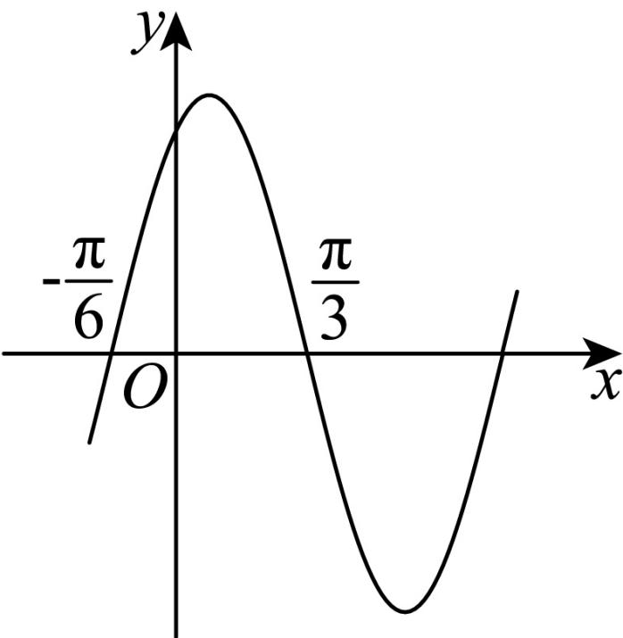

<!-- question-source:start -->
7. $f(x) = 2\sin (\omega x + \varphi)(\omega >0,0 <   \varphi <  \pi)$ 的部分图象如图所示，则 $f(-\frac{\pi}{24})$ 的值为（）

A 1
B $\sqrt{2}$ C $\sqrt{3}$ D 2
<!-- question-source:end -->

![[Q00092212A1]]
