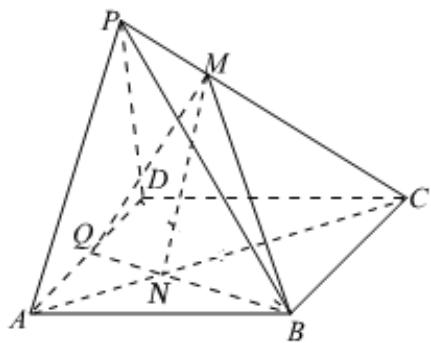

> [!faq]- 2024-2025学年内蒙古兴安盟科尔沁右翼前旗二中高一（下）月考数学试卷（6月份）解析
>
> > [!success]- **【答案】** C
>
> > [!note]- **【解析】**
> > 如图，连接 $AC$ ，记 $AC \cap BQ = N$ ，连接 $MN$
> >
> > ∵底面ABCD为平行四边形，
> >
> > $$
> > \therefore \frac {A N}{N C} = \frac {A Q}{B C} = \frac {1}{2}
> > $$
> >
> > ∵ PA∥平面MQB，PA⊂平面PAC，平面PAC∩平面
> >
> > $$
> > M Q B = M N
> > $$
> >
> > $$
> > \therefore P A \parallel M N
> > $$
> >
> > $\therefore \frac{PM}{MC} = \frac{AN}{NC} = \frac{AQ}{BC} = \frac{1}{2}.$
> >
> > 
> >
> > 故选：C.
