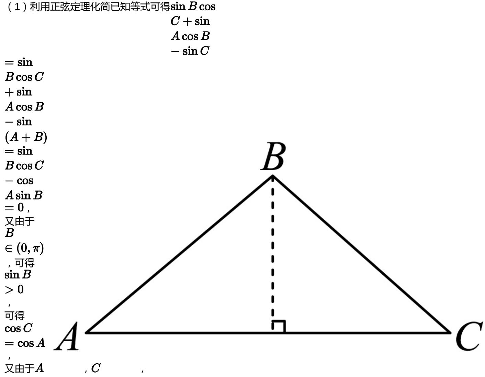

> [!faq]- 2024-2025学年内蒙古兴安盟科尔沁右翼前旗二中高一（下）月考数学试卷（6月份）解析
>
> > [!success]- **【答案】** 详见解析
>
> > [!note]- **【解析】**
> > 详见解析
> >
> > (1) 利用正弦定理化简已知等式可得 $\sin B\cos$
> >
> > 
> >
> > $$
> > \in (0, \pi) \quad \in (0, \pi)
> > $$
> >
> > 可得C=A，
> >
> > 可得 $\triangle ABC$ 为等腰三角形；
> >
> > (2)由（1）设等腰三角形两腰，即c，a为x，
> >
> > 因为b=4，
> >
> > 则由图结合勾股定理可得，边 $b$ 对应的高为 $\sqrt{x^2 - 2^2} = \sqrt{x^2 - 4}$
> >
> > 则 $2\sqrt{x^2 - 4} = 4\sqrt{3} \Rightarrow x = 4$ ，即 $\triangle ABC$ 为等边三角形，则角 $B$ 为 $\frac{\pi}{3}$ .
