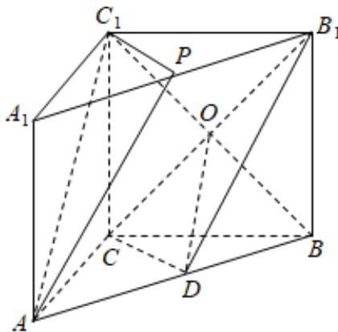

> [!faq]- 2024-2025学年内蒙古兴安盟科尔沁右翼前旗二中高一（下）月考数学试卷（6月份）解析
>
> > [!success]- **【答案】** 详见解析
>
> > [!note]- **【解析】**
> > 详见解析
> >
> > 证明：（1）设 $BC_{1}$ 与 $B_{1}C$ 的交点为O，连结OD，
> >
> > ∵四边形 $BCC_{1}B_{1}$ 为平行四边形，∴O为 $B_{1}C$ 中点，
> >
> > 又 $D$ 是 $AB$ 的中点， $\therefore OD$ 是三角形 $ABC_{1}$ 的中位线，则 $OD \parallel AC_{1}$
> >
> > 又： $AC_{1}\notin$ 平面 $B_{1}CD$ ， $OD\subset$ 平面 $B_{1}CD$
> >
> > $\therefore AC_{1} // 平面B_{1}CD ;$
> >
> > (2)∵P为线段 $A_{1}B_{1}$ 的中点，点D是AB的中点，
> >
> > $\therefore AD \parallel B_{1}P$ 且 $AD = B_{1}P$ ，则四边形 $ADB_{1}P$ 为平行四边形，$\therefore AP \parallel DB_{1}$ 又 $\because AP\notin$ 平面 $B_{1}CD$ ， $DB_{1}\subset$ 平面 $B_{1}CD$ $\therefore AP \parallel$ 平面 $B_{1}CD$ 又 $AC_{1} / /$ 平面 $B_{1}CD$ ， $AC_{1}\cap AP = A$ ，且 $AC_{1}\subset$ 平面 $APC_{1}$ $AP\subset$ 平面 $APC_{1}$ $\therefore$ 平面 $APC_1 / /$ 平面 $B_{1}CD$
> >
> > 
