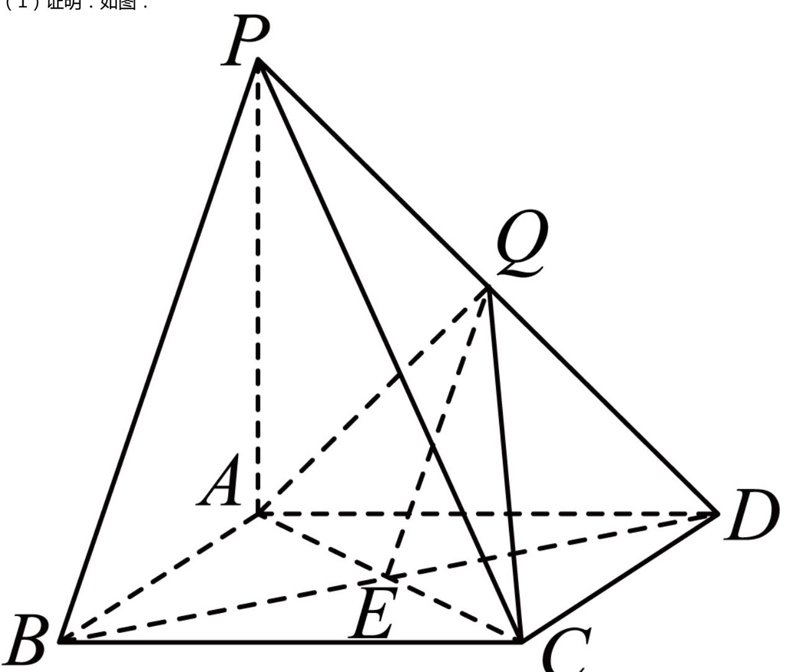

> [!faq]- 2024-2025学年内蒙古兴安盟科尔沁右翼前旗二中高一（下）月考数学试卷（6月份）解析
>
> > [!success]- **【答案】** 详见解析
>
> > [!note]- **【解析】**
> > 详见解析
> >
> > (1) 证明：如图：
> >
> > 
> >
> > 在四棱锥 $P - ABCD$ 中，连接 $BD$ ，交 $AC$ 于 $\pmb{E}$ ，因为四边形 $ABCD$ 为正方形，所以 $\pmb{E}$ 为 $BD$ 中点，又 $Q$ 为 $PD$ 中点，所以 $EQ / / PB$ ，又 $EQ\subset$ 平面 $ACQ$ ， $PB\notin$ 平面 $ACQ$ 所以 $PB / /$ 平面 $ACQ.$ (2)②因为 $PA\bot$ 平面 $ABCD$ ，所以 $\triangle PAD$ 是直角三角形，又 $Q$ 为 $PD$ 中点，且 $AQ\bot PD$ ，所以 $AP = AD = 2.$ 设点 $P$ 到平面 $ACQ$ 的距离为 $h$ ，则 $V_{P - ACQ} = \frac{1}{3} S_{\triangle ACQ}\bullet h.$ 又因为 $S_{\triangle APQ} = \frac{1}{2} S_{\triangle APD} = \frac{1}{2}\times \frac{1}{2}\times AP\times AD = \frac{1}{2}\times \frac{1}{2}\times 2\times 2 = 1,$ 所以 $V_{P - ACQ} = V_{C - APQ} = \frac{1}{3} S_{\triangle APQ}\bullet CD = \frac{1}{3}\times 1\times 2 = \frac{2}{3}.$ 因为 $PA\bot$ 平面 $ABCD$ ， $CD\subset$ 平面 $ABCD$ ，所以 $CD\bot PA$ 又底面ABCD为正方形，所以 $CD\bot AD$ ， $PA$ ， $AD\subset$ 平面APD， $PA\cap AD = A$ 所以 $CD\bot$ 平面APD.  
> > 又 $PD\subset$ 平面APD，所以 $CD\bot PD.$ 所以 $\triangle CDQ$ 为直角三角形
> >
> > $\triangle ACQ$ 中， $AQ = \sqrt{2}$ ， $CQ = \sqrt{CD^2 + DQ^2} = \sqrt{2^2 + (\sqrt{2})^2} = \sqrt{6}$ ， $AC = 2\sqrt{2}$
> >
> > 因为 $AQ^{2}+CQ^{2}=AC^{2}$ ，则 $AQ\perp CQ$ ，
> >
> > 所以 $S_{\triangle ACQ} = \frac{1}{2}\times \sqrt{2}\times \sqrt{6} = \sqrt{3}.$
> >
> > 所以 $h = \frac{3\times\frac{2}{3}}{\sqrt{3}} = \frac{2\sqrt{3}}{3}.$
> >
> > 即点P到平面ACQ的距离为 $\frac{2\sqrt{3}}{3}$ .
> >
> > 又 $PC = \sqrt{AP^2 + AC^2} = \sqrt{4 + 8} = 2\sqrt{3}$
> >
> > ①设直线CP与平面ACQ所成的角为 $\theta$ ，
> >
> > 则 $sin\theta = \frac{h}{PC} = \frac{\frac{2\sqrt{3}}{3}}{2\sqrt{3}} = \frac{1}{3}.$
> >
> > 即直线PC与平面ACQ所成角的正弦值为 $\frac{1}{3}$ .
