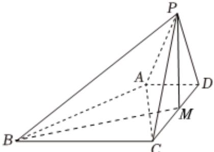

> [!faq]- 2024-2025学年内蒙古兴安盟科尔沁右翼前旗二中高一（下）月考数学试卷（6月份）解析
>
> > [!success]- **【答案】** 详见解析
>
> > [!note]- **【解析】**
> > 详见解析
> >
> > (1) 证明: 在 $\triangle PCD$ 中, 取 $CD$ 的中点 $M$ , 连接 $PM$ ,
> >
> > $\because PC = PD$ ，所以 $PM \perp CD$
> >
> > $\because$ 侧面 $PCD \perp$ 平面 $ABCD$ ，且侧面 $PCD \cap$ 平面 $ABCD = CD$ ， $PM \subset$ 平面 $PCD$
> >
> > ∴ PM⊥平面ABCD，
> >
> > $\because BC \subset \text{平面}ABCD, \therefore PM \perp BC$
> >
> > 又 $BC \perp PC, PM \cap PC = P, PM, PC \subset$ 平面 $PCD$ ,
> >
> > ∴ BC⊥平面PCD.
> >
> > 
> >
> > (2)证明：由（1）知 $BC \perp$ 平面 $PCD$ ，又 $CD \subset$ 平面 $PCD$
> >
> > $\therefore BC \perp CD$
> >
> > 在 $\triangle ACD$ 中， $\because AD = 1, CD = 2, AC = \sqrt{5}$
> >
> > $\therefore AD^{2} + CD^{2} = AC^{2}$
> >
> > 即 $AD \perp CD$
> >
> > 在同一平面ABCD中，∵AD⊥CD，BC⊥CD，
> >
> > $\therefore BC \parallel AD$
> >
> > ∵ BC ≠ 平面 PAD，AD ⊂ 平面 PAD，
> >
> > ∴ BC // 平面 PAD.
> >
> > (3)由（1）知 $PM \perp$ 平面ABCD，连接MB，
> >
> > 则 $\angle PBM$ 为直线 $BP$ 与平面ABCD所成的角.
> >
> > 在 $Rt\triangle BCM$ 中， $BC = 3$ ， $CM = 1$ ， $\therefore BM = \sqrt{BC^2 + CM^2} = \sqrt{3^2 + 1^2} = \sqrt{10}$
> >
> > 在 $Rt\triangle PBM$ 中， $\tan \angle PBM = \frac{PM}{BM}$
> >
> > ∵直线BP与平面ABCD所成角的正切值为 $\frac{\sqrt{10}}{5}$ ，
> >
> > $$
> > \therefore \frac {P M}{\sqrt {1 0}} = \frac {\sqrt {1 0}}{5}
> > $$
> >
> > 即PM=2.
> >
> > $\therefore$ 三棱锥 $P - ABC$ 的体积 $V_{P - ABC} = \frac{1}{3}\times \frac{1}{2}\times BC\times CD\times PM = \frac{1}{3}\times \frac{1}{2}\times 3\times 2\times 2 = 2.$
