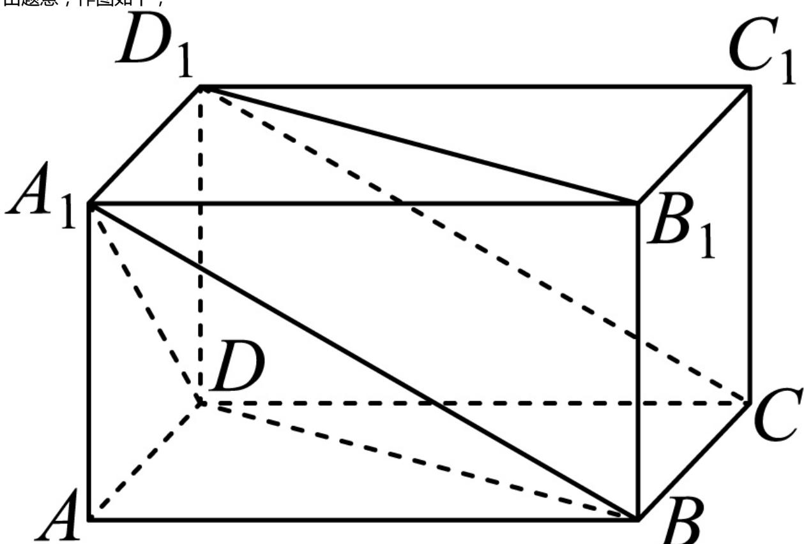

> [!faq]- 2024-2025学年内蒙古兴安盟科尔沁右翼前旗二中高一（下）月考数学试卷（6月份）解析
>
> > [!success]- **【答案】** B
>
> > [!note]- **【解析】**
> > 由题意，作图如下，
> >
> > 
> >
> > 因为 $A_{1}D$ 和 $CD_{1}$ 与底面所成的角分别为 $45^{\circ}$ 和 $30^{\circ}$
> >
> > 所以 $\angle A_{1}DA = 45^{\circ}$ ， $\angle D_{1}CD = 30^{\circ}$ ，设 $AD = 1$
> >
> > 在 $Rt\triangle ADA_{1}$ 中，易知 $AA_{1} = AD = 1$
> >
> > 在 $Rt\triangle D_1DC$ 中， $DD_{1} = AA_{1} = 1$ ， $DD_{1}\bot CD$ ， $CD = \frac{DD_1}{tan30^\circ} = \sqrt{3}$
> >
> > 在长方体 $ABCD - A_{1}B_{1}C_{1}D_{1}$ 中，易知 $BD \parallel B_{1}D_{1}$
> >
> > 则 $\angle A_{1}DB$ 为异面直线 $A_{1}D$ 与 $B_{1}D_{1}$ 所成的角或其补角，
> >
> > 在 $Rt\triangle ABD$ 中， $AD^{2} + AB^{2} = BD^{2}$ ，则 $BD = 2$ ，同理可得 $A_{1}D = \sqrt{2},A_{1}B = 2,$
> >
> > 由余弦定理，得 $cos\angle A_1DB = \frac{A_1D^2 + BD^2 - A_1B^2}{2A_1D\bullet BD} = \frac{2 + 4 - 4}{2\times\sqrt{2}\times 2} = \frac{\sqrt{2}}{4}.$
> >
> > 故选：B.
