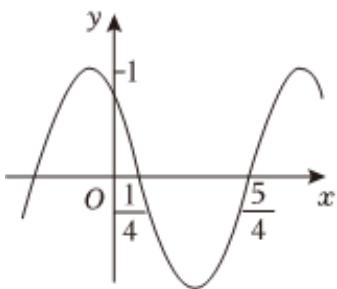

<!-- question-source:start -->
7、函数 $f(x) = \cos(\omega x + \varphi)$ 的部分图象如图所示，则 $f(x)$ 的单调递减区间为（）

A $\left[k\pi -\frac{1}{4},k\pi +\frac{3}{4}\right],k\in Z$

B $[2k\pi -\frac{1}{4},2k\pi +\frac{3}{4}],k\in Z$ C $[k - \frac{1}{4},k + \frac{3}{4}],k\in Z$ D $[2k - \frac{1}{4},2k + \frac{3}{4}],k\in Z$
<!-- question-source:end -->

![[Q00090674A1]]
