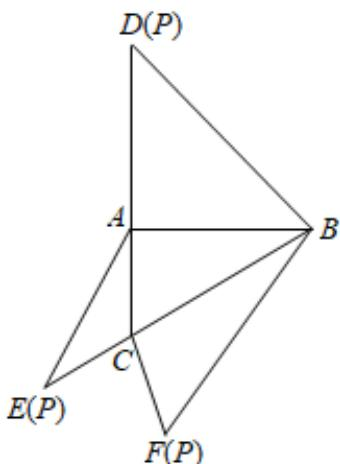

<!-- question-source:start -->
3、如图，在三棱锥 $P - ABC$ 的平面展开图中， $AC = 1$ ， $AB = AD = \sqrt{3}$ ， $AB \perp AC$ ， $AB \perp AD$ ， $\angle CAE = 30^\circ$ ，则 $\cos \angle FCB =$ \_\_\_\_.

<!-- question-source:end -->

![[Q00090681A1]]
