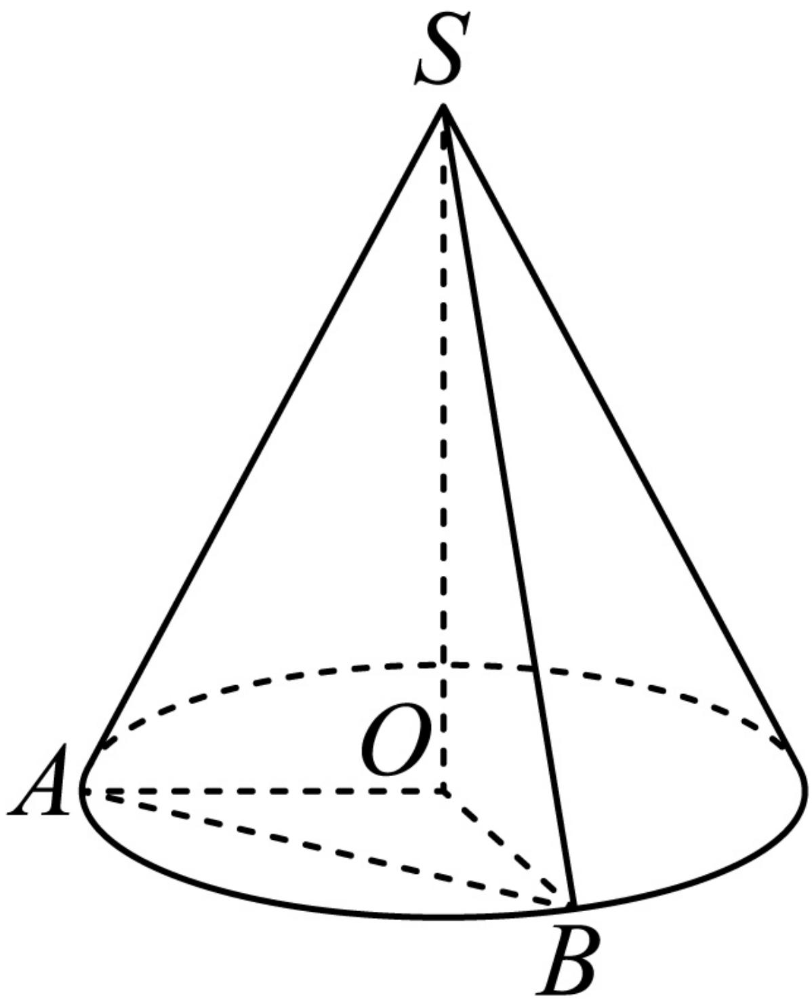

<!-- question-source:start -->
3、

已知圆锥 $SO$ 的底面圆半径为2，体积为 $\frac{8\sqrt{2}}{3}\pi$ ，两条母线 $SA$ 、 $SB$ 的夹角为 $60^{\circ}$

1 求圆锥SO的侧面积；

2 求三棱锥 $S - AOB$ 的体积；

3 求三棱锥 $O - SAB$ 的高.
<!-- question-source:end -->

![[Q00090684A1]]
