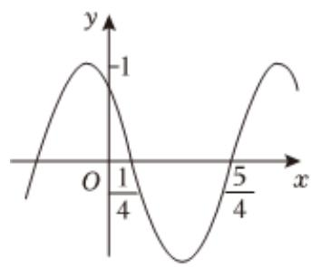

> [!faq]- 2024-2025学年内蒙古兴安盟科尔沁右翼前旗二中高一（下）期中数学试卷解析
>
> > [!success]- **【答案】** D
>
> > [!note]- **【解析】**
> > 根据函数 $f(x)=\cos(\omega x+\varphi)$ 的部分图象如图，
> >
> > 可得 $\frac{1}{2} \times \frac{2\pi}{\omega} = \frac{5}{4} - \frac{1}{4}, \therefore \omega = \pi.$
> >
> > 再根据五点法作图，可得 $\pi \times \frac{1}{4} +\varphi = \frac{\pi}{2},\therefore \varphi = \frac{\pi}{4}$ $\therefore f(x) = \cos (\pi x + \frac{\pi}{4}).$
> >
> > 
> >
> > 令 $2k\pi \leqslant \pi x + \frac{\pi}{4} \leqslant 2k\pi + \pi, k \in Z$ ，求得 $2k - \frac{1}{4} \leqslant x \leqslant 2k + \frac{3}{4}, k \in Z,$
> >
> > 故函数 $f(x)$ 的减区间为 $\left[2k-\frac{1}{4},2k+\frac{3}{4}\right],k\in Z.$
> >
> > 故选：D.
