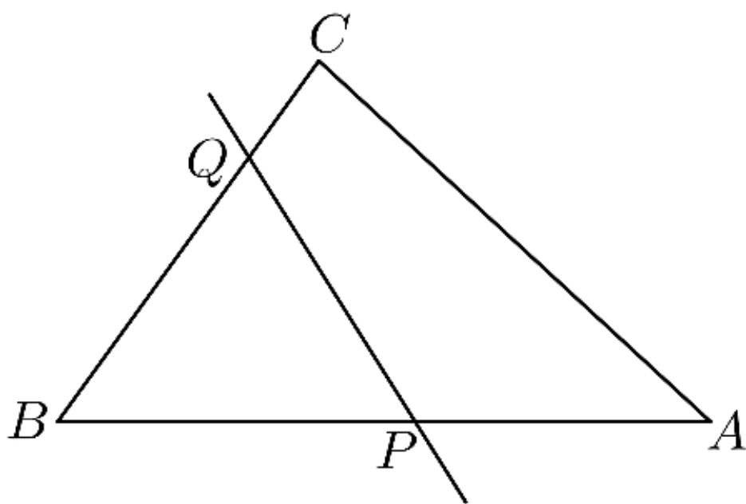

> [!faq]- 2024-2025学年内蒙古兴安盟科尔沁右翼前旗二中高一（下）期中数学试卷解析
>
> > [!success]- **【答案】** 详见解析
>
> > [!note]- **【解析】**
> > 详见解析
> >
> > (1) 由 $2b \cos A = 2c - a$ 及正弦定理，
> >
> > 可得 $2\sin B\cos A = 2\sin C - \sin A$
> >
> > $$
> > = 2 \sin (A + B) - \sin A
> > $$
> >
> > 即 $2\sin B\cos A = 2\sin B\cos A$
> >
> > $$
> > + 2 \sin A \cos B - \sin A
> > $$
> >
> > 整理得 $\sin A = 2\sin A\cos B$
> >
> > 因为 $0^{\circ} < A < 180^{\circ}$ ，所以 $\sin A \neq 0$ ，故 $\cos B = \frac{1}{2}$ ，
> >
> > 因为 $0^{\circ} < B < 180^{\circ}$ ，所以
> >
> > $$
> > B = 6 0 ^ {\circ}
> > $$
> >
> > (2)由（1）知，
> >
> > $$
> > A = 1 8 0 ^ {\circ} - 6 0 ^ {\circ} - 7 5 ^ {\circ} = 4 5 ^ {\circ}
> > $$
> >
> > 则 $\sin A = \sin 45^{\circ} = \frac{\sqrt{2}}{2}$ ，
> >
> > 由正弦定理，得
> >
> > 
> >
> > $b = a \times \frac{\sin B}{\sin A} = 2\sqrt{2} \times \frac{\frac{\sqrt{3}}{2}}{\frac{\sqrt{2}}{2}} = 2\sqrt{3}$ ;
> >
> > (3)因为 $a = 2, c = 3, B = 60^{\circ}$ ,
> >
> > 所以 $S_{\triangle ABC}=\frac{1}{2}acsin B=\frac{1}{2}\times2\times3\times\frac{\sqrt{3}}{2}=\frac{3\sqrt{3}}{2}$
> >
> > 设 $BQ = m$ ， $BP = n$ ， $0 <   m\leqslant 2$ ， $0 <   n\leqslant 3$
> >
> > $$
> > S _ {\triangle B P Q} = \frac {1}{2} m n \sin B = \frac {\sqrt {3}}{4} m n
> > $$
> >
> > 因为 $PQ$ 把 $\triangle ABC$ 的面积分成相等的两部分，
> >
> > 则有 $S_{\triangle BPQ} = \frac{1}{2} S_{\triangle ABC}$ ，即 $\frac{\sqrt{3}}{4} mn = \frac{3\sqrt{3}}{4}$ ，解得 $mn = 3$
> >
> > 由余弦定理得： $PQ^{2} = m^{2} + n^{2} - 2mn\cos B = m^{2} + n^{2} - mn$
> >
> > 由基本不等式得： $PQ^{2} = m^{2} + n^{2} - mn\geqslant 2mn - mn = mn = 3$
> >
> > 当且仅当 $m = n = \sqrt{3}$ 时，等号成立，
> >
> > 故 $|PQ|\geq\sqrt{3}$ ，即线段PQ长的最小值为 $\sqrt{3}$ .
