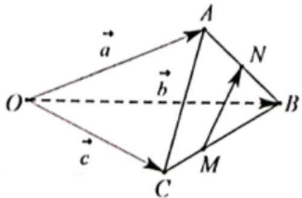

<!-- question-source:start -->
3、如图，设 $\overrightarrow{OA} = \overrightarrow{a}$ ， $\overrightarrow{OB} = \overrightarrow{b}$ ， $\overrightarrow{OC} = \overrightarrow{c}$ ，若 $\overrightarrow{AN} = \overrightarrow{NB}$ ， $\overrightarrow{BM} = 2\overrightarrow{MC}$ ，则 $\overrightarrow{MN} = (\quad)$

A $\frac{1}{2}\overrightarrow{a} +\frac{1}{6}\overrightarrow{b} -\frac{2}{3}\overrightarrow{c}$ B $-\frac{1}{2}\overrightarrow{a} -\frac{1}{6}\overrightarrow{b} +\frac{2}{3}\overrightarrow{c}$ C $\frac{1}{2}\overrightarrow{a} -\frac{1}{6}\overrightarrow{b} -\frac{1}{3}\overrightarrow{c}$ D $-\frac{1}{2}\overrightarrow{a} +\frac{1}{6}\overrightarrow{b} +\frac{1}{3}\overrightarrow{c}$
<!-- question-source:end -->

![[Q00091762A1]]
