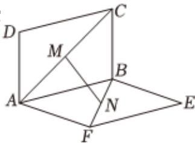

<!-- question-source:start -->
3、如图所示的实验装置中，两个正方形框架ABCD，ABEF的边长都是1，且它们所在平面相互垂直，活动弹子M，N分别在对角线CA，BF上移动，且CM = BN = a(0 < a < $\sqrt{2}$ )，则MN的取值范围是\_\_\_\_.

<!-- question-source:end -->

![[Q00091773A1]]
