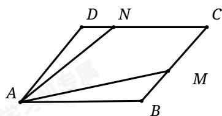

<!-- question-source:start -->
7. 如图，平行四边形ABCD中，M是BC中点，N是CD上靠近点D的三等分点，若 $\overrightarrow{AB}=\lambda\overrightarrow{AM}+\mu\overrightarrow{AN}\quad(\lambda,\mu\in\mathbb{R})$ ，则 $\lambda+\mu$ 的值为（）

A. $-\frac{9}{5}$ B. $-\frac{3}{5}$ C. $\frac{9}{5}$ D. $\frac{3}{5}$
<!-- question-source:end -->

![[Q00091292A1]]
