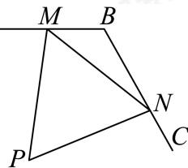

<!-- question-source:start -->
14. 如图，某幼儿园计划在一个两面靠墙的角落规划一个三角形活动区域（即△PMN区域），地面形状如图所示．已知点M，N分别在AB，BC上，

$\angle ABC = 120^{\circ}, BM = 30\mathrm{m}, BN = 50\mathrm{m}, \angle MPN = 60^{\circ}$ ，则 $PM + PN$ 最长为 \_\_\_\_ m.

<!-- question-source:end -->

![[Q00091299A1]]
